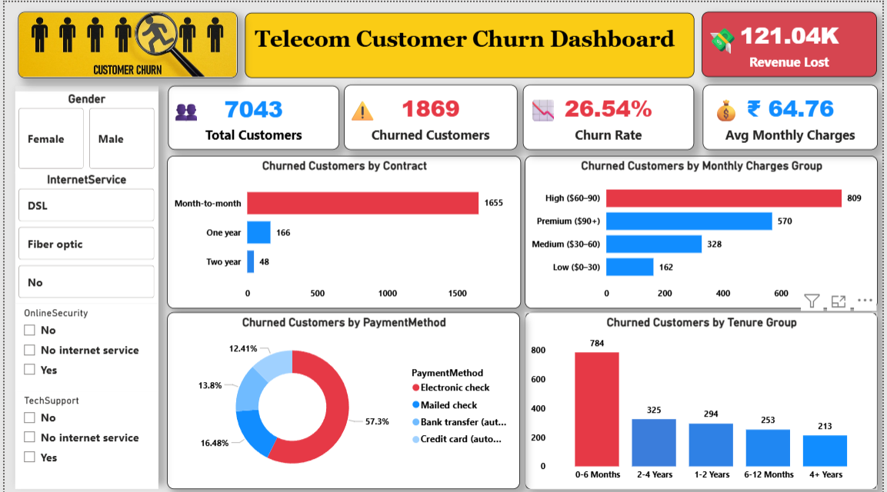

# 📊 Telecom Customer Churn Analysis


---

## 📌 Project Overview

This project analyzes telecom customer data to identify churn patterns and key factors affecting customer retention.

---

## 🎯 Objectives

* Identify customers likely to churn
* Analyze customer behavior
* Provide actionable business insights

---

## 🛠️ Tech Stack

* Python (Pandas, NumPy, Matplotlib, Seaborn)
* SQL
* Power BI

---

## 📂 Project Structure

```
telecom-churn-analysis/
│
├── notebooks/
├── sql/
├── dashboard/
├── images/
├── data/
└── README.md
```

---

## 🔍 Key Analysis

* Data Cleaning & Preprocessing
* Exploratory Data Analysis (EDA)
* SQL-based insights
* Customer segmentation

---
## 📊 Dashboard Preview



---
## 📊 Dashboard Insights

* Churn by contract type
* Monthly charges vs churn
* Tenure vs churn
* Internet service analysis

---

## 📈 Key Findings

* Customers with month-to-month contracts have higher churn
* Higher monthly charges increase churn probability
* New customers are more likely to churn
* Fiber optic users show higher churn

---

## 📌 Conclusion

This project helps identify high-risk customers and supports data-driven retention strategies.

---

## 🚀 How to Run

1. Clone the repository
2. Open Jupyter Notebook
3. Run `churn_analysis.ipynb`
